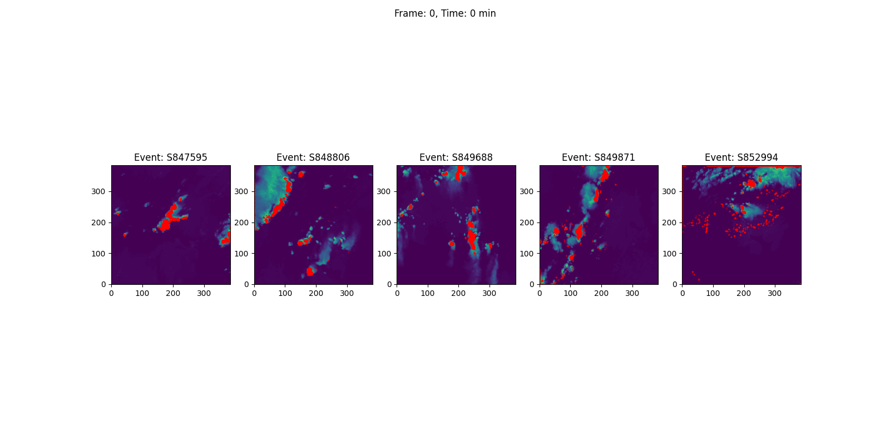

# Predict Lightning

## Get started

Set up the environment with pixi. Download the dataset.

For any `pixi run` command, you may use `--help` to understand the default arguments and how to set up custom pipelines, e.g. `pixi run download-data --help`.

```bash
pixi install
pixi run download-data
pixi run explore-data
# explore-data writes events EDA figures in ./figures/
pixi run explore-train-h5
# explore-train-h5 writes train.h5 EDA artifacts in ./figures/h5_eda/
# - h5_schema_summary.csv
# - h5_channel_stats.csv
# - h5_lightning_summary.csv
# - h5_frame_intensity_trends.csv
# - h5_lightning_frame_trend.csv
# - h5_event_type_summary.csv (if events.csv is present)
# - *.png summary figures
pixi run preprocess-hdf5
# preprocess-hdf5 writes:
# - data/preprocessed_train.h5
# - data/preprocess_summary.csv
# - figures/preprocess/*.png
# NOTE: this is used to sample preprocessing design steps
```

## Train the model

```bash
# preprocess train dataset
pixi run preprocess-hdf5 \
  --input-h5 data/train.h5 \
  --output-h5 data/preprocess_train.h5 \
  --summary-csv data/preprocess_summary_train.csv \
  --figures-dir figures/preprocess \
  --direction down \
  --max-events -1

# train model
pixi run train-model \
    --data-path data/preprocessed_train.h5 \
    --model unet \
    --loss multitask \
    --epochs 100 \
    --batch-size 8 \
    --num-workers 1 \
    --seed 42 \
    --checkpoint-dir models/unet \
    --device gpu
```

## Predict on unseen

```bash
pixi run predict \
    --model models/unet \
    --data-path data/test.h5 \
    --device gpu
```
Example predictions of lighting, visualized on top of the cloud evolution. Frames are at 5 minute intervals.



